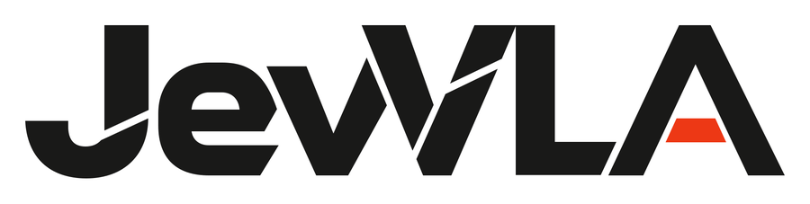
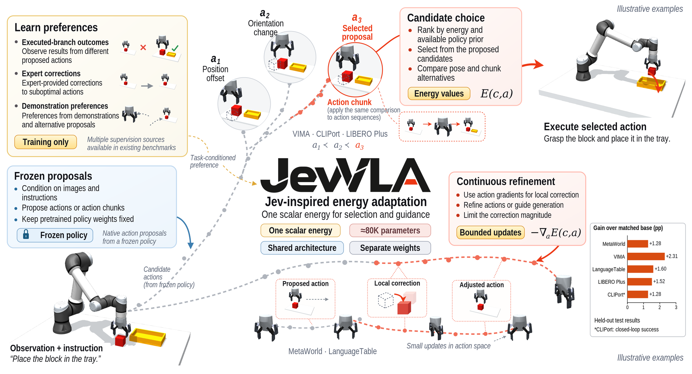
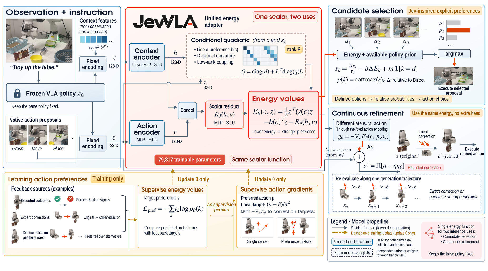
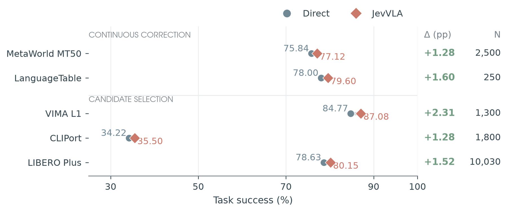

<p align="center">
  
</p>

<h2 align="center">Jev-Inspired Energy-Based Adaptation for Vision-Language-Action Policies</h2>

<p align="center"><a href="https://zju4embodiedai.github.io/JevVLA/">Project website</a> · <a href="#installation">Installation</a> · <a href="#training">Training</a></p>

JevVLA learns a lightweight action preference function on top of a frozen vision-language-action policy. The same conditional energy architecture selects among proposed actions and guides continuous actions through its gradients, supporting both pick-and-place decisions and action chunks.

Inspired by Jev's probabilistic decision-graph ideas, JevVLA turns feedback about alternative actions into a reusable preference field. Benchmark adapters encode policy features and actions into a shared interface; each benchmark trains its own energy weights.



## Architecture



The energy combines a context-conditioned quadratic term with an MLP residual. The default model uses 128-dimensional context features, 32-dimensional action features, hidden width 128, and rank 8, with **79,817 trainable parameters**.

The public `score` method returns utility, and `energy` returns its negative. Higher utility gives an action more probability during candidate selection. For continuous actions, the utility gradient provides a correction direction, with configurable gain, coordinate clipping, and action bounds.

| Benchmark | Action interface | Adapter |
| --- | --- | --- |
| CLIPort | Pick-and-place candidates | [cliport.py](src/jevvla/adapters/cliport.py) |
| VIMA | Pick-and-place candidates | [vima.py](src/jevvla/adapters/vima.py) |
| LIBERO Plus | Action-chunk candidates | [libero.py](src/jevvla/adapters/libero.py) |
| LanguageTable | Continuous action correction | [language_table.py](src/jevvla/adapters/language_table.py) |
| MetaWorld MT50 | Continuous action-chunk guidance | [metaworld.py](src/jevvla/adapters/metaworld.py) |

## Results

Task success with Direct and JevVLA across the five benchmarks:



## Installation

Use Python 3.11 or newer. From the repository root:

```bash
pip install .
```

For the JAX energy implementation and MetaWorld guidance:

```bash
pip install ".[jax]"
```

Install the base policy and simulator in the environment used for the corresponding benchmark. The MetaWorld guidance adapter integrates with an OpenPI policy.

## Use the energy model

Candidate probabilities and selection share the same utility function:

```python
import torch
from jevvla import JevVLA, candidate_probabilities, select_candidate

model = JevVLA().eval()
context = torch.randn(2, 128)
candidates = torch.randn(2, 6, 32)
direct_index = torch.tensor([0, 2])

with torch.no_grad():
    probabilities = candidate_probabilities(model, context, candidates, direct_index)
    selected = select_candidate(model, context, candidates, direct_index)

print(probabilities.shape, selected.shape)
```

Continuous guidance differentiates the utility with respect to the action:

```python
import torch
from jevvla import JevVLA, correct_action

model = JevVLA().eval()
context = torch.randn(2, 128)
action = torch.randn(2, 32)

corrected = correct_action(model, context, action, gain=0.08, component_clip=0.12)
print(corrected.shape)
```

Load trained weights with `JevVLA.from_checkpoint("outputs/adapter.pt", device="cpu")`. Supply an `action_encoder` to `correct_action` when guiding native actions with a dimension other than 32.

## Training

Training consumes NumPy archives containing frozen-policy features and action supervision. Dataset size and candidate count come from the supplied arrays.

```bash
jevvla train \
  --benchmark cliport \
  --data data/train.npz \
  --validation data/validation.npz \
  --output outputs/cliport.pt \
  --device cuda
```

Profiles are available for `cliport`, `vima`, `libero`, `language_table`, `metaworld`, and `metaworld_continuation`. [profiles.py](src/jevvla/profiles.py) defines the training and inference settings. CLI flags override the learning rate, batch size, epoch count, random seed, and preference objective. A TOML file supplied through `--config` can override any `TrainingConfig` field, for example:

```toml
learning_rate = 0.0003
batch_size = 128
epochs = 80
seed = 42
```

Candidate preference training uses the following arrays:

| Array | Shape | Content |
| --- | --- | --- |
| `context` | `[N, 128]` or `[N, 32]` | Observation and policy features |
| `candidate` | `[N, K, 32]` | Encoded action candidates |
| `target` | `[N, K]` | Nonnegative preference distribution, summing to one per row |
| `prior` | `[N, K]` | Optional base-policy prior logits |
| `candidate_mask` | `[N, K]` | Optional validity mask |
| `direct_index` | `[N]` | Optional index of the base policy's Direct action |
| `terminal_success` | `[N, K]` | Binary candidate outcomes for pairwise supervision or success-based selection |
| `weight` | `[N]` | Optional DSM or gradient-matching sample weight |
| `episode_id` | `[N]` | Optional episode identifiers for checking split overlap |

Continuous training adds `native_action` with shape `[N, K, D]` for denoising supervision, or `action` and `gradient_target` with shape `[N, D]` for gradient matching. Gaussian-mixture supervision uses `centers`, `mixture_weights`, and `sigma`. The benchmark adapters provide feature encoders and supervision preparation functions.

LanguageTable combines preference, denoising, and future-action supervision:

```bash
jevvla train \
  --benchmark language_table \
  --data data/train.npz \
  --validation data/validation.npz \
  --future data/future_train.npz \
  --future-validation data/future_validation.npz \
  --output outputs/language_table.pt \
  --device cuda
```

Future-action archives contain `context` with shape `[N, 128]`, native `action` with shape `[N, 2]`, and optional `weight`. The LanguageTable adapter also converts the policy-feature records accepted by its preparation functions.

Use `--warmstart` to continue from an energy checkpoint. To refit at the epoch selected on validation, pass `--refit data/refit.npz`; add `--refit-future` when using future-action supervision.

## Closed-loop evaluation

Connect a benchmark through a Python factory that returns the environment, adapted policy, and success predicate. The factory receives `checkpoint`, `device`, and options supplied through `--factory-options`.

```bash
jevvla evaluate \
  --factory benchmark_runner:make_evaluator \
  --checkpoint outputs/adapter.pt \
  --seeds 0 1 2 3 4 \
  --max-steps 200 \
  --device cuda
```

The factory returns a dictionary with:

| Key | Interface |
| --- | --- |
| `environment` | `reset(seed=...)` and `step(action)` using the Gym reset and step interface |
| `policy` | Callable observation-to-action policy, or an object exposing `infer` |
| `success` | Callable `success(environment, observation, info)` returning a boolean |
| `reset_options` | Optional dictionary passed to environment reset |
| `action_transform` | Optional callable converting policy output to the simulator's action format |

The evaluator supports four- and five-value step returns and reports episode count, successful episodes, and aggregate success rate. `jevvla evaluate-records` additionally computes selection outcomes from candidate arrays and their terminal labels.

## Code layout

- [model.py](src/jevvla/model.py): conditional quadratic energy and residual network.
- [losses.py](src/jevvla/losses.py): preference, denoising, gradient, and future-action objectives.
- [inference.py](src/jevvla/inference.py): candidate probabilities, selection, and continuous guidance.
- [training.py](src/jevvla/training.py): optimization, validation selection, and checkpoint export.
- [adapters](src/jevvla/adapters): benchmark encoders, feedback preparation, and policy integration.
- [evaluation.py](src/jevvla/evaluation.py): closed-loop rollout and candidate-record evaluation.

## Project website

The [project website](https://zju4embodiedai.github.io/JevVLA/) includes a 3D robot action lab, paired evaluation cases, an interactive energy illustration, benchmark results, and expandable research figures. Preview it locally:

```bash
python -m http.server 8000 --directory docs
```

Open `http://localhost:8000`. The site is ready for GitHub Pages using the `main` branch and the `/docs` directory.
